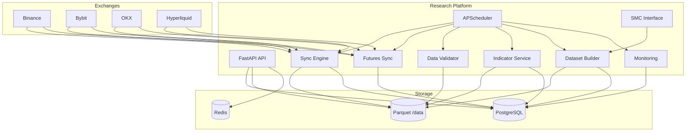

# System Architecture — Phase 1

## Overview

The research platform is a clean-architecture Python service that ingests historical crypto market data, validates it, computes features, and builds research datasets for downstream AI and backtesting modules.

## Layer Responsibilities

| Layer | Path | Role |
|-------|------|------|
| API | `app/api/` | HTTP endpoints, request validation |
| Core | `app/core/` | Config, structured JSON logging |
| Models | `app/models/` | SQLAlchemy ORM definitions |
| Schemas | `app/schemas/` | Pydantic request/response DTOs |
| Repositories | `app/repositories/` | Dual-write Parquet + PostgreSQL |
| Services | `app/services/` | Business logic (sync, validation, features) |
| Storage | `app/storage/` | Parquet file layout and streaming writes |
| Indicators | `app/indicators/` | Polars-based indicator framework |
| SMC | `app/smc/` | Protocol + stub detector (Phase 2: full engine) |
| Workers | `app/workers/` | APScheduler lifecycle |
| Tasks | `app/tasks/` | Job implementations |

## Data Flow

1. **Ingest** — CCXT adapters fetch OHLCV, funding, open interest
2. **Store** — Batch write to Parquet; upsert to PostgreSQL (no duplicates)
3. **Validate** — Gap, duplicate, ordering, price checks
4. **Features** — Indicators computed via Polars LazyFrames
5. **Dataset** — Join candles + indicators + SMC + context → research Parquet

## Database Schema

Core tables: `symbols`, `candles`, `funding_rates`, `open_interest`, `market_metadata`, `sync_jobs`, `system_health`, `indicator_values`, `smc_features`, `feature_datasets`.

Open interest table includes `metadata_json` for future liquidation fields.

## Performance Design

- Polars LazyFrames for out-of-core processing
- Batch upserts (5000 rows) to PostgreSQL
- Incremental sync from last known timestamp
- Gap repair limited to 50 gaps per run
- Parquet ZSTD compression

## Future Phase Integration Points

| Phase | Integration |
|-------|-------------|
| 2 SMC Engine | Implement `SmcDetector` protocol, replace `StubSmcDetector` |
| 3 Backtest | Read feature datasets + candles from Parquet |
| 4 Dashboard | Query API + PostgreSQL |
| 5 Qdrant | Index dataset rows as vectors |
| 6 AI Agent | Consume feature datasets + sync API |
| 7–8 Trading | Symbol registry + live candle feed from sync engine |
| 9 n8n | Webhook triggers on `/sync/start` |
| 10 Multi-exchange | Add adapter class + register in `get_exchange_adapter` |

## Deployment

Docker Compose stack: `postgres`, `redis`, `research-api`.

Production: point `DATABASE_URL` to Supabase, mount persistent volume for `/app/data`.
