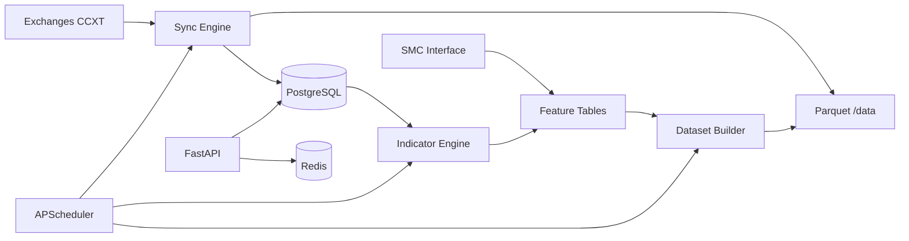

# Phase 1 — Institutional Data Research Platform

## Vision

Production-grade historical market data layer powering all future phases (backtest, AI agent, Qdrant, paper/live trading, strategy evolution).

## Architecture

```
research-platform/
├── app/
│   ├── api/              # FastAPI routers
│   ├── core/             # Config, logging, exceptions
│   ├── models/           # SQLAlchemy ORM
│   ├── schemas/          # Pydantic request/response
│   ├── repositories/     # DB + Parquet access
│   ├── services/         # Business logic
│   ├── storage/          # Parquet layout, streaming writes
│   ├── indicators/       # Polars indicator framework
│   ├── smc/              # SMC interfaces (Phase 1: schema only)
│   ├── workers/          # APScheduler jobs
│   ├── tasks/            # Task definitions
│   └── utils/            # Helpers
├── alembic/              # PostgreSQL migrations
├── tests/
├── data/                 # Parquet (gitignored)
└── docker/
```

## Milestones (1-by-1)

| # | Milestone | Deliverables | Status |
|---|-----------|--------------|--------|
| M1 | **Foundation** | Structure, config, Docker, DB migrations, `/health`, logging | ✅ Done |
| M2 | **Storage layer** | Parquet paths, streaming writes, dual-write repo | ✅ Done |
| M3 | **Exchange adapters** | CCXT base + Binance, Bybit, OKX, Hyperliquid | ✅ Done |
| M4 | **OHLCV sync** | Full + incremental download, dedup, gap detect/repair | ✅ Done |
| M5 | **Futures data** | Funding rates, open interest tables + sync | ✅ Done |
| M6 | **Validation** | Missing/duplicate/order checks, reports | ✅ Done |
| M7 | **Indicator engine** | EMA, RSI, ATR, MACD, VWAP + DB persist | ✅ Done |
| M8 | **SMC interfaces** | Normalized BOS/CHOCH/OB/FVG schema, stub detector | ✅ Done |
| M9 | **Dataset builder** | Feature parquet + DB for AI training | ✅ Done |
| M10 | **Scheduler** | APScheduler: sync, validate, indicators, dataset | ✅ Done |
| M11 | **Full API** | All endpoints + Redis health | ✅ Done |
| M12 | **Tests & docs** | Unit tests, README, env guide, architecture diagram | ✅ Done |

## Data Flow



## Database Tables

- `symbols` — exchange, symbol, market_type, active
- `candles` — OHLCV, unique (exchange, symbol, timeframe, ts)
- `funding_rates` — futures funding history
- `open_interest` — OI snapshots (liquidations-ready schema)
- `market_metadata` — sync cursors, last candle ts
- `sync_jobs` — job status, errors, progress
- `system_health` — freshness, storage metrics
- `indicator_values` — computed features per candle
- `smc_features` — normalized SMC outputs (Phase 1 stub)
- `feature_datasets` — dataset build metadata

## Future Phase Hooks

| Phase | Plugs into |
|-------|------------|
| 2 Full SMC | `app/smc/detectors/` |
| 3 Backtest | `candles` + `indicator_values` + `smc_features` |
| 4 Dashboard | FastAPI + existing Node frontend |
| 5 Qdrant | `feature_datasets` export |
| 6 AI Agent | Dataset builder output |
| 7–10 | Same DB, new services |

## Performance Rules

- Polars LazyFrame for batch indicator compute
- Chunked CCXT fetch (1000 candles/request)
- Stream Parquet writes (PyArrow RecordBatch)
- Never load full year 15m for 100 symbols in RAM at once
- Process per (exchange, symbol, timeframe) job
