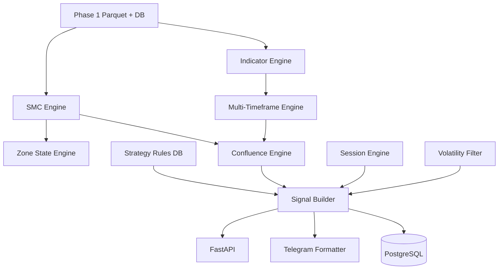

# Phase 2 — Indicator & SMC Engine

## Overview

Phase 2 is the **single source of truth** for market features, structure, and signal generation. All downstream systems (backtest, AI, paper/live trading) consume standardized outputs from this layer.

## Modules

| Path | Responsibility |
|------|----------------|
| `app/indicators/` | Modular indicators: calculate / validate / serialize |
| `app/indicators/mtf.py` | 15m + 1h + 4h feature merge |
| `app/smc/` | BOS, CHOCH, FVG, OB, liquidity, sweeps, zones |
| `app/signals/` | Confluence, volatility, sessions, rules, signals |
| `app/services/analysis_service.py` | Orchestration + persistence |

## API Endpoints

| Method | Path | Description |
|--------|------|-------------|
| GET | `/indicators?mtf=true` | Single TF or MTF snapshot |
| GET | `/smc` | Full SMC analysis |
| GET | `/bos`, `/choch`, `/fvg`, `/order-blocks`, `/liquidity` | Structure queries |
| GET | `/signals` | Historical signal candidates |
| POST | `/signals/generate` | Run rules + build signal |
| GET | `/confluence` | Confluence score breakdown |

## Database Migration

Run in Supabase SQL Editor:

`supabase/migrations/008_phase2_engine.sql`

## Future Integration

| Phase | Consumes |
|-------|----------|
| 3 Backtest | `signal_candidates`, indicator parquet |
| 4 Dashboard | All GET endpoints |
| 5 Qdrant | Serialized signal + feature vectors |
| 6 AI Agent | `/signals/generate` + MTF features |
| 7–8 Trading | `TradingSignal` schema |

See also: [PHASE2-DEVELOPER-GUIDE.md](PHASE2-DEVELOPER-GUIDE.md)
